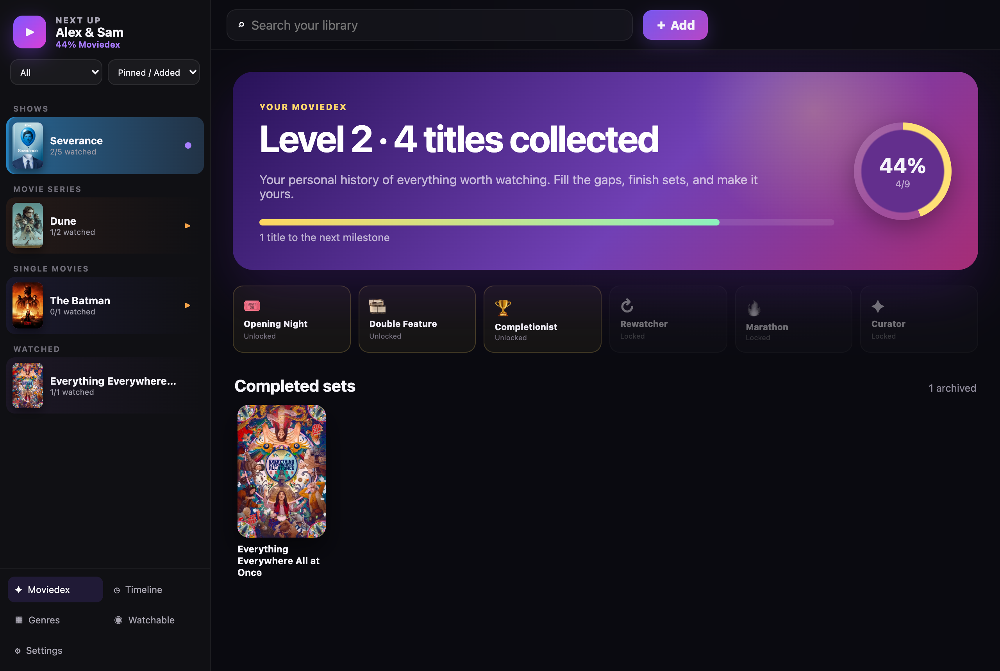

# Next Up

Next Up is a private-by-default movie and TV watch tracker for one person, a
couple, a family, or a movie club. It runs as a desktop app on Windows and
macOS, keeps the library on the user's computer, and works without an account,
cloud server, analytics, or AI.

> The cross-platform Tauri app is the public beta. The original SwiftUI macOS
> app remains in this repository while feature parity and migration are tested.



## What do we watch tonight?

Next Up is built around that one question, and its best features come back to answering it:

- **See how long you've got left.** Every series and set shows the runtime remaining to
  finish it — "2h 24m remaining" right in the header — so you don't start a three-hour
  movie when it's already late.
- **Keep what's next in front of you.** Pin titles as *Watching* or *Next Up* and they
  rise to the top of the sidebar; the thing you're mid-way through is always the first
  thing you see.
- **Watchable** filters your unwatched list down to what's actually streaming tonight on
  the services you pay for.
- **Sealed group ratings** let everyone score in secret, revealed only once the last
  person votes — so no one's score sways the room.
- **The Moviedex** turns your library into a collection to fill: you level up as you
  finish titles, completed sets become trophies, and there are badges for milestones.

New here? The [getting-started guide](desktop/GETTING-STARTED.md) walks through all of it
with screenshots.

## Everything it tracks

- Movies, movie series, shows, episodes, partial sessions, and rewatches
- One-step TVmaze import of a show's announced seasons and episodes, with large
  full-row season expanders
- Separate half-star ratings, short reviews, favorites, and “rewatch?” votes
- One to twelve profiles with optional sealed group ratings
- A permanent watch timeline, genre view, progress stats, and Moviedex achievements
- Sidebar sort and filter by watching, next up, unwatched, watched, title, progress,
  public rating, or recent activity
- Saved watch links only for the services a household selects
- Optional Watchmode enrichment: movie artwork, runtime, genres, scores, and US availability
- Portable JSON export and restore
- A separate, optional local MCP package for Codex, Claude, Hermes, OpenClaw, and other
  compatible assistants

## Installing

Download the Windows or macOS installer from the repository's **Releases** page, then
follow the [getting-started guide](desktop/GETTING-STARTED.md) — it walks through
installation, adding your first movies and shows, and every setting, with screenshots.

No developer tools, Watchmode key, or AI setup are required after installation.

## Run from source

Requirements: Node.js 22+, Rust stable, and the platform prerequisites listed in
the [official Tauri guide](https://v2.tauri.app/start/prerequisites/).

```sh
git clone YOUR_REPOSITORY_URL
cd NextUp/desktop
npm ci
npm run desktop:dev
```

Checks used in CI:

```sh
cd desktop
npm test
npm run build
cargo check --manifest-path src-tauri/Cargo.toml
cd ..
node Tests/mcp-smoke.mjs
./scripts/scan-secrets.sh
```

Build platform-native installers with `npm run desktop:build`. Tauri creates
Windows NSIS/MSI bundles on Windows and an app bundle/DMG on macOS; GitHub
Actions builds both so developers do not need two computers.

## First run and migration

Onboarding accepts one to twelve unique profile names. AI is off by default.
The app starts with an empty library, and users can add movies manually without
any API key. Show search and episode import use TVmaze and also need no API key;
Watchmode is only needed for enriched movie search and availability.

On macOS, the cross-platform app automatically imports the original app's
`~/Library/Application Support/Next Up/library.json` the first time it opens.
It copies rather than deletes the old file. New data is stored in the platform
application-data folder under `com.nextup.watchtracker` and saved atomically
with a one-step backup.

## Optional integrations

Watchmode and AI/MCP are independent opt-ins:

- **Watchmode:** enter a key in Settings. It is kept in macOS Keychain or
  Windows Credential Manager—not in the library or exports.
- **AI/MCP:** the app works fully without it. The optional server uses local
  standard input/output, opens no network port, and exposes explicit read and
  write tools. Read [AI setup and permissions](AI_SETUP.md) before enabling it.

## Project map

- `desktop/` — React/TypeScript UI and Rust/Tauri desktop shell for Windows/macOS
- `MCP/` — optional dependency-free local MCP server
- `Sources/`, `Package.swift` — original native macOS implementation
- `Tests/` — native, integration, and MCP regression tests
- `docs/` — architecture, privacy, ratings, releases, and tester guides

## Privacy, security, and contributing

Read [Privacy](docs/PRIVACY.md), [Security](SECURITY.md), and
[Contributing](CONTRIBUTING.md). Do not commit personal library exports, API
keys, credential files, or screenshots containing account information.

TV series discovery in the legacy app and MCP package uses TVmaze under its
published terms; see [third-party notices](THIRD_PARTY_NOTICES.md).

Next Up is MIT licensed.
