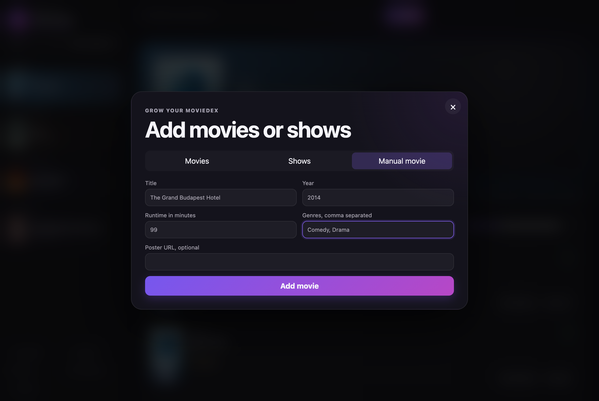
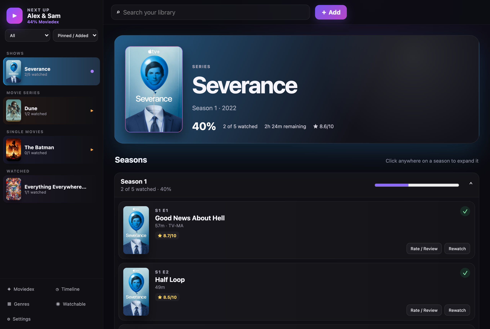
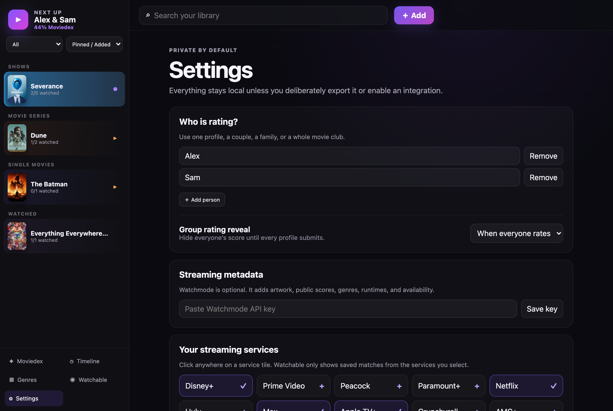
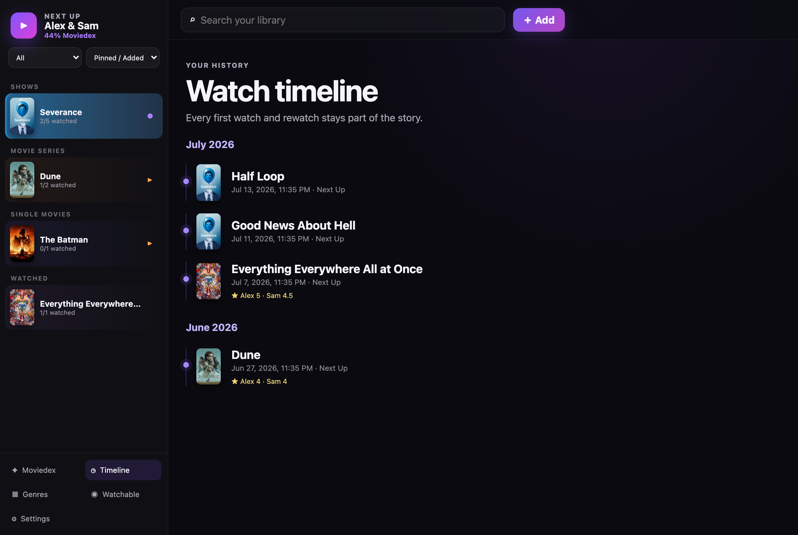

# Getting started with Next Up

Next Up keeps track of the movies and shows you're working through — what's next, what
you've finished, and what everyone thought of it. Your whole library lives in a single
file on your own computer. Nothing syncs to a server, and nothing leaves the machine
unless you export it yourself.

Here's what it looks like once you've added a few things:

## Installing

### Windows

1. Download the file ending in **`-setup.exe`** from the release page.
2. Run it. Windows may say it's from an unknown publisher — click **More info → Run
   anyway**. The app isn't code-signed yet, so that warning is expected.
3. If it offers to install the **Edge WebView2** component, let it.
4. Launch **Next Up** from the Start menu.

### macOS

1. Download the **`.dmg`** — the Apple Silicon build for M-series Macs, the Intel build
   for older ones.
2. Drag **Next Up** into Applications.
3. The first time, right-click the app and choose **Open**, then **Open** again. macOS
   only does this once for unsigned apps.

The first time it opens, you'll pick who's watching — just you, you and a partner, the
whole household, whatever fits. You can change this later.

## Adding movies and shows

Everything starts with the **＋ Add** button in the top right. It opens three tabs.

**Movies** searches a catalog and fills everything in for you — poster, runtime, year,
age rating, and where it's streaming. Type "Dune", click Add, and it lands in your
library fully filled out. This tab uses Watchmode; see [Settings](#settings-and-options)
below to switch it on. It's free and optional.

**Shows** works the same way but for TV, and it needs no setup at all. Search a series —
say "Severance" — and Next Up pulls in the whole episode list, organized by season. Every
episode becomes something you can check off on its own.

**Manual movie** is the fallback for anything the catalog doesn't have, or when you just
don't feel like searching. Type a title, year, and runtime, optionally paste a poster
URL, and you're done. Good for a film-festival short, a home movie, or something obscure.

## Working through your list

Open any title and you get a page like this:

From here you can:

- **Mark it watched** with the ✓ button. For a show you tick episodes off one at a time,
  and the season bar fills in as you go.
- **Pin a priority** — set something to **Watching** or **Next Up** and it floats to the
  top of the sidebar. Useful when you've got five things going at once.
- **Log partial progress** with **＋30m** on movies, for when you doze off halfway and
  want to remember where you stopped.
- **Rate and review** once it's watched. If more than one person has a profile, ratings
  stay sealed until everyone has voted — so nobody's score sways the room.

## Settings and options

The Settings page (gear icon, bottom-left) is where you tune things:

- **Who is rating** — add or rename profiles. One person, a couple, a whole movie club,
  up to a dozen.
- **Group rating reveal** — hide everyone's score until all profiles have rated, or show
  them right away.
- **Streaming metadata** — paste a free Watchmode API key to turn on Movies search and
  automatic posters and availability. The key goes in your OS keychain, not the library
  file. Skip it and the app still works fine.
- **Your streaming services** — tick the ones you actually pay for. The **Watchable**
  view then shows which unwatched titles you can stream right now.
- **Own your data** — export the whole library to a JSON file any time, or import one
  back. That's your backup.

## Finding your way around

The left sidebar groups collections into Shows, Movie Series, and Single Movies, and
tucks finished sets under Watched. The buttons along the bottom switch views:

- **Moviedex** — your progress and milestones (the first screenshot up top).
- **Timeline** — everything you've watched, newest first.

- **Genres** — a breakdown of what you tend to reach for.
- **Watchable** — unwatched titles available on the services you picked.

That's really it. Add something, mark it watched, and the rest fills itself in as you go.

---

*The screenshots above use a sample library (Severance, Dune, and a couple of movies) so
none of your own titles are on display.*
